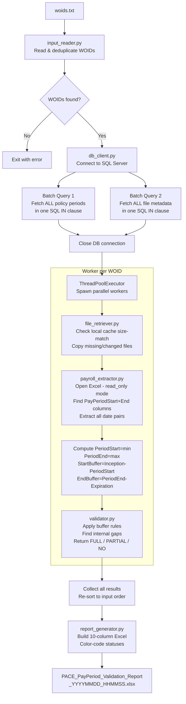

# PACE Payroll Period Coverage Validator — Complete Workflow & Technical Guide

This document explains the entire system end-to-end: how each file works, how data flows through the pipeline, and how the validation logic makes its decisions — with examples written for both technical and non-technical readers.

---

## Table of Contents

1. [What This System Does (Non-Technical)](#1-what-this-system-does-non-technical)
2. [System Architecture (Technical)](#2-system-architecture-technical)
3. [Full Execution Flowchart](#3-full-execution-flowchart)
4. [File-by-File Deep Dive](#4-file-by-file-deep-dive)
   - [config.py](#41-configpy)
   - [logger_setup.py](#42-logger_setuppy)
   - [input_reader.py](#43-input_readerpy)
   - [db_client.py](#44-db_clientpy)
   - [file_retriever.py](#45-file_retrieverpy)
   - [payroll_extractor.py](#46-payroll_extractorpy)
   - [validator.py](#47-validatorpy)
   - [report_generator.py](#48-report_generatorpy)
   - [main.py](#49-mainpy)
5. [Validation Logic — Full Explanation](#5-validation-logic--full-explanation)
   - [Non-Technical Explanation](#51-non-technical-explanation)
   - [Technical Explanation](#52-technical-explanation)
   - [Buffer Logic — Every Possible Case](#53-buffer-logic--every-possible-case)
6. [Complete Example: 3 WOIDs Processed End-to-End](#6-complete-example-3-woids-processed-end-to-end)

---

## 1. What This System Does (Non-Technical)

> **Imagine you run a business and hire workers through contracts (policies). Each policy has a start date (InceptionDate) and an end date (ExpirationDate). For each contract, the workers submit payroll sheets showing which dates they worked. Your job is to check: "Did the payroll sheets cover all the dates in the contract?"**

This system automates exactly that check for potentially hundreds of contracts at once.

- It reads a list of contract IDs (called **WOIDs** — Work Order IDs) from a text file.
- For each WOID, it looks up the contract dates from a database.
- It then downloads the associated payroll Excel files and reads the dates from them.
- It checks if those dates cover the contract period.
- It generates a color-coded Excel report showing which contracts are **fully covered**, **partially covered**, or **not covered at all**.

---

## 2. System Architecture (Technical)

```
woids.txt
    │
    ▼
input_reader.py  ──→  [List of WOIDs]
                              │
                              ▼
                       db_client.py  ──→  SQL Server
                       (2 batch queries)       │
                              │         ┌──────┴──────────┐
                              │    PolicyPeriods     FileMetadata
                              │         └──────┬──────────┘
                              ▼                │
                       main.py (ThreadPoolExecutor — up to 8 parallel workers)
                              │
                    ┌─────────┼─────────┐
                    ▼         ▼         ▼
              [Worker 1]  [Worker 2]  [Worker 3]  ...
                    │
              ┌─────┴──────────────────────┐
              │   file_retriever.py        │  ← copies/caches Excel files
              │   payroll_extractor.py     │  ← reads PayPeriodStart/End columns
              │   validator.py             │  ← checks coverage + buffer logic
              └─────┬──────────────────────┘
                    │
                    ▼
              [Result dict per WOID]
                    │
                    ▼
            report_generator.py  ──→  PACE_PayPeriod_Validation_Report_YYYYMMDD_HHMMSS.xlsx
```

---

## 3. Full Execution Flowchart



---

## 4. File-by-File Deep Dive

### 4.1 `config.py`

**Role:** Single source of truth for all configuration values.

| Setting | Value | Purpose |
|---|---|---|
| `BASE_DIR` | Script's folder | Root path for all relative paths |
| `DATASET_DIR` | `BASE_DIR/dataset` | Where payroll Excel files are saved locally |
| `OUTPUT_REPORT` | `BASE_DIR/PACE_PayPeriod_Validation_Report.xlsx` | Base path used to derive timestamped filename |
| `LOG_FILE` | `BASE_DIR/pace_validator.log` | Full debug log destination |
| `BUFFER_DAYS` | `25` | Tolerance (in days) on each side of policy dates |
| `get_connection_string()` | pyodbc string | SQL Server connection (Windows Auth, Read-Only intent) |
| `QUERY_POLICY_PERIOD` | SELECT SQL | Fetches InceptionDate + ExpirationDate for a WOID |
| `QUERY_FILE_INFO` | SELECT SQL | Fetches DocName + ReposSpec (file path) for a WOID |

> **Why centralize config?** If the server changes, buffer changes, or query changes — you edit only ONE file. No hunting through 9 Python files.

---

### 4.2 `logger_setup.py`

**Role:** Configures unified logging for the entire application.

```
Console  →  INFO level and above  (clean, minimal)
Log file →  DEBUG level and above (full trace, timestamps)
```

**Format:** `2026-06-09 18:30:00 | INFO | WOID 12345 - Processing ...`

Every module calls `setup_logger()` which returns the same shared logger (Python's logging module deduplicates handlers automatically via the `if logger.handlers` guard).

> **Why log to both console AND file?** Console gives real-time feedback while running. The file preserves history — critical when something fails at 2am and you need to diagnose it the next morning.

---

### 4.3 `input_reader.py`

**Role:** Reads the list of WOIDs the user wants to validate.

**Supported formats:**
- **`.txt`** — One WOID per line. Blank lines ignored.
- **`.xlsx` / `.xls`** — First column is read regardless of header name.

**Deduplication:** If the same WOID appears twice, it is processed once. The original order is preserved.

```python
# Example input (woids.txt):
12345
67890
12345   ← duplicate, ignored
99999

# Result: ["12345", "67890", "99999"]
```

---

### 4.4 `db_client.py`

**Role:** All database communication. Optimized to use exactly 2 SQL queries regardless of how many WOIDs are processed.

#### Batch Query Strategy

Instead of looping: `SELECT ... WHERE woid = '12345'` then `SELECT ... WHERE woid = '67890'` (2N queries for N WOIDs), the system dynamically builds:

```sql
-- Query 1: All policy periods in one shot
SELECT woid, InceptionDate, ExpirationDate
FROM osi..WOPolicy (nolock)
WHERE woid IN ('12345', '67890', '99999')

-- Query 2: All file paths in one shot
SELECT PrimaryIndex, DocName, ReposSpec
FROM Docrepository..Documents (nolock)
WHERE PrimaryIndex IN ('12345', '67890', '99999')
  AND DocDesc = 'PACE Extracted'
```

**SQL Server parameter limit:** SQL Server supports max ~2100 parameters in an `IN` clause. The code chunks WOIDs into batches of 500 to stay safe.

**Dynamic query building:** The batch queries are constructed by reading `config.py`'s SQL strings and using regex to replace `= ?` with `IN (?, ?, ...)`. This means if you change the table name or add a filter in `config.py`, the batch version automatically picks it up.

**Fallback:** If the batch query fails (e.g. network hiccup), the code automatically falls back to querying one WOID at a time, so the run never fully crashes.

**`_to_date(value)`:** SQL Server can return dates as `datetime`, `date`, or `string`. This helper normalizes all of them to Python `datetime.date`.

---

### 4.5 `file_retriever.py`

**Role:** Locates payroll Excel files on the network/disk and copies them into the local `dataset/<WOID>/` folder.

#### How File Location Works

`ReposSpec` from the database is a path without extension, e.g. `D:\PACE\DATA\12345`.

The code:
1. Checks if `D:\PACE\DATA\12345` exists as-is (no extension).
2. If not, scans the parent folder `D:\PACE\DATA\` for any file whose stem is `12345` (e.g. `12345.xlsx`, `12345.xls`).
3. If multiple matches, prefers the one without extension, then alphabetically first.

#### Smart File-Level Cache

Before copying, the code checks:
```python
if dest_path.is_file() and dest_path.stat().st_size == source_file.stat().st_size:
    # Skip copy — file already exists and matches source size
```

This means on the second run for the same WOIDs, the file copy step is nearly instant. If a file changes (size differs), it is re-copied automatically.

> **Why size-based and not date-based?** Network drives often have unreliable "modified" timestamps across systems. File size is a reliable, fast-to-read proxy for detecting changes.

---

### 4.6 `payroll_extractor.py`

**Role:** Opens each Excel file, finds the right columns, and extracts all payroll date pairs.

#### Column Detection

The code normalizes all header cell text (lowercase, strip all spaces) before matching:
- `"Pay Period Start "` → `"payperiodstart"` ✅ matches
- `"PayPeriodStart"` → `"payperiodstart"` ✅ matches
- `"pay_period_start"` → `"pay_period_start"` ❌ would not match (underscores not stripped)

This makes it robust against capitalization and spacing inconsistencies.

#### Fast Reading with `openpyxl read_only=True`

Standard pandas `read_excel()` loads the entire file into memory including styles, formulas, images, and merged cells. For large payroll files this is very slow.

`openpyxl` with `read_only=True, data_only=True`:
- Streams the file row by row without loading styles.
- `data_only=True` reads computed cell values rather than formula text (`=SUM(...)` → `42.0`).
- **Result:** Up to 5× faster than pandas for large files.

#### What Gets Returned Per WOID

```python
{
    "periods": [(date(2025,1,1), date(2025,1,31)),
                (date(2025,2,1), date(2025,2,28)), ...],
    "sheets_processed": 3,
    "files_count": 2
}
```

Duplicates are removed in-place using a `seen` set keyed on the raw string pair `(s_str, e_str)` before parsing to dates — preventing double-counting the same row appearing in multiple sheets.

---

### 4.7 `validator.py`

**Role:** The core algorithmic brain. Takes policy dates and payroll date pairs and returns a verdict.

> See Section 5 for the full detailed explanation with examples.

**Key functions:**
- `validate_coverage()` — main entry point, applies buffer logic and returns status + gaps.
- `_merge_periods()` — merges overlapping/adjacent date ranges into consolidated blocks.
- `_clip_to_policy()` — trims payroll ranges that extend outside the policy window.
- `_find_gaps()` — identifies missing date ranges within the policy window.

---

### 4.8 `report_generator.py`

**Role:** Produces the final formatted Excel workbook.

#### Report Structure

**Row 1:** Title — "PayPeriod Validation Summary"

**Rows 3–6:** Summary metrics
```
Total WOIDs Processed:  9
FULL:                   5
PARTIAL:                3
NO:                     1
```

**Row 8:** Column headers (dark blue background, white bold text)

**Rows 9+:** One row per WOID with all 10 columns

#### Color Coding

| Column | Color Rule |
|---|---|
| Coverage = FULL | Green font + light green background |
| Coverage = PARTIAL | Amber font + light yellow background |
| Coverage = NO | Red font + light pink background |
| StartBuffer / EndBuffer within ±25 | Green bold value |
| StartBuffer / EndBuffer exceeds ±25 | Red bold value |

#### Report Filename

Generated dynamically at runtime:
```
PACE_PayPeriod_Validation_Report_20260609_213000.xlsx
```

This prevents Excel file-lock crashes (if the previous report is still open) and creates an automatic audit trail.

---

### 4.9 `main.py`

**Role:** The orchestrator. Connects all modules in the correct order.

#### Execution Steps

```
1.  Read WOIDs from woids.txt
2.  Connect to SQL Server
3.  Run 2 batch queries (fetch all policy periods + file metadata at once)
4.  Close DB connection immediately (no longer needed)
5.  Start ThreadPoolExecutor (up to 8 workers)
6.  For each WOID in parallel:
        a. Retrieve / cache files  (file_retriever)
        b. Extract payroll dates   (payroll_extractor)
        c. Compute PeriodStart, PeriodEnd, StartBuffer, EndBuffer
        d. Run validation          (validator)
        e. Return result dict
7.  Re-sort results to match original input order
8.  Build timestamped report filename
9.  Generate Excel report          (report_generator)
10. Log summary: Total | FULL | PARTIAL | NO | Elapsed time
```

#### Error Safety

Every WOID is wrapped in a `try/except` inside the thread pool. If one WOID crashes (e.g. corrupted Excel file), it is marked `NO` with an error log, and all other WOIDs continue processing uninterrupted.

---

## 5. Validation Logic — Full Explanation

### 5.1 Non-Technical Explanation

> **Think of the policy period like a road trip from City A to City B.** The InceptionDate is where you start, and the ExpirationDate is where you need to arrive. The payroll sheets are like driving logs showing which roads you drove on which dates.

**The check has two parts:**

**Part 1 — Did you start and end close enough to the right places?**
We allow a "buffer" of 25 days. This means:
- Your driving log can start up to 25 days before OR after you left City A — that's still close enough.
- Your driving log can end up to 25 days before OR after you reached City B — that's still close enough.

If your log starts 34 days before departure or 34 days after — that's too far off, and it won't count as FULL.

**Part 2 — Is there any missing stretch in the middle?**
Even if you started and ended close to the right cities, if there's a gap where you have no driving log for a week in the middle of the trip — that's PARTIAL coverage.

**Only if BOTH parts pass → FULL.**

---

### 5.2 Technical Explanation

The validator computes four key values:

```
PeriodStart  = min(all PayPeriodStart dates across all files and sheets)
PeriodEnd    = max(all PayPeriodEnd   dates across all files and sheets)

StartBuffer  = InceptionDate  − PeriodStart
               (positive = payroll started BEFORE inception = early coverage)
               (negative = payroll started AFTER  inception = late start)

EndBuffer    = PeriodEnd − ExpirationDate
               (positive = payroll ended AFTER  expiration = extra coverage)
               (negative = payroll ended BEFORE expiration = ended too early)
```

**FULL requires ALL THREE conditions:**

```
Condition 1:  abs(StartBuffer) <= 25
Condition 2:  abs(EndBuffer)   <= 25
Condition 3:  No internal gaps within [InceptionDate, ExpirationDate]
```

**Internal gap** = a date range inside the policy window where no payroll period exists, and it is not at the very start or very end (those are handled by the buffer conditions).

**Algorithm steps inside `validate_coverage()`:**

```
1. Filter out any malformed payroll periods where start > end (log warning).
2. Compute PeriodStart, PeriodEnd, StartBuffer, EndBuffer.
3. Check buffer conditions (start_ok, end_ok).
4. Merge all payroll periods into consolidated non-overlapping blocks.
5. Clip merged blocks to [InceptionDate, ExpirationDate].
6. If nothing overlaps with policy window → return NO.
7. Find all gaps within the policy window.
8. Classify gaps:
      - Gap at very start (gap_start == InceptionDate) → edge gap, forgiven if start_ok
      - Gap at very end   (gap_end   == ExpirationDate) → edge gap, forgiven if end_ok
      - All other gaps → internal gaps, NEVER forgiven
9. If start_ok AND end_ok AND no internal gaps → FULL
   Otherwise → PARTIAL with list of unforgiven gaps
```

---

### 5.3 Buffer Logic — Every Possible Case

All examples use: **InceptionDate = 2025-04-22**, **ExpirationDate = 2026-04-22**, **BUFFER_DAYS = 25**

| # | PeriodStart | PeriodEnd | StartBuffer | EndBuffer | Internal Gap? | Status | Why |
|---|---|---|---|---|---|---|---|
| 1 | 2025-04-22 | 2026-04-22 | 0 ✅ | 0 ✅ | No | **FULL** | Exact match |
| 2 | 2025-04-10 | 2026-04-30 | +12 ✅ | +8 ✅ | No | **FULL** | Starts 12d early, ends 8d late — within ±25 |
| 3 | 2025-04-30 | 2026-04-10 | -8 ✅ | -12 ✅ | No | **FULL** | Starts 8d late, ends 12d early — within ±25 |
| 4 | 2025-03-28 | 2026-05-17 | +25 ✅ | +25 ✅ | No | **FULL** | Exactly at the ±25 limit on both sides |
| 5 | 2025-03-27 | 2026-05-17 | **+26 ❌** | +25 ✅ | No | **PARTIAL** | StartBuffer 26 > 25, one day over limit |
| 6 | 2025-03-28 | 2026-05-18 | +25 ✅ | **+26 ❌** | No | **PARTIAL** | EndBuffer 26 > 25, one day over limit |
| 7 | 2025-01-01 | 2026-04-22 | **+111 ❌** | 0 ✅ | No | **PARTIAL** | Payroll starts far too early |
| 8 | 2025-04-22 | 2026-12-31 | 0 ✅ | **+253 ❌** | No | **PARTIAL** | Payroll runs far too late |
| 9 | 2025-04-10 | 2026-04-30 | +12 ✅ | +8 ✅ | **Yes (Jun–Aug)** | **PARTIAL** | Buffers OK but a gap exists in the middle |
| 10 | 2024-01-01 | 2024-12-31 | **+477 ❌** | **-477 ❌** | — | **NO** | No overlap with policy window at all |
| 11 | 2025-04-22 | 2026-03-28 | 0 ✅ | **-25 ✅** | No | **FULL** | Ends exactly 25d before expiration — at limit |
| 12 | 2025-04-22 | 2026-03-27 | 0 ✅ | **-26 ❌** | No | **PARTIAL** | Ends 26d before expiration — one day over |

---

## 6. Complete Example: 3 WOIDs Processed End-to-End

### Setup

`woids.txt` contains:
```
WOID_A
WOID_B
WOID_C
```

### Step 1 — Input Reading

`input_reader.py` loads and deduplicates → `["WOID_A", "WOID_B", "WOID_C"]`

### Step 2 — Database (2 queries total)

```
Policy Periods returned:
  WOID_A: InceptionDate=2025-01-01, ExpirationDate=2025-12-31
  WOID_B: InceptionDate=2025-04-22, ExpirationDate=2026-04-22
  WOID_C: InceptionDate=2025-06-01, ExpirationDate=2026-06-01

File Metadata returned:
  WOID_A: [payroll_A1.xlsx, payroll_A2.xlsx]
  WOID_B: [payroll_B1.xlsx]
  WOID_C: (no files found in DB)
```

### Step 3 — Parallel Processing

All three WOIDs are processed simultaneously by 3 worker threads.

---

#### Thread 1: WOID_A

**File Retrieval:**
`payroll_A1.xlsx` already exists in `dataset/WOID_A/` and matches source size → **cache hit, skip copy**.
`payroll_A2.xlsx` is new → **copied from network**.

**Extraction:**
- `payroll_A1.xlsx` Sheet1: extracted periods `[(2025-01-01, 2025-06-30)]`
- `payroll_A2.xlsx` Sheet1: extracted periods `[(2025-07-01, 2025-12-31)]`
- Combined: `[(2025-01-01, 2025-06-30), (2025-07-01, 2025-12-31)]`

**Computed Values:**
```
PeriodStart  = 2025-01-01
PeriodEnd    = 2025-12-31
StartBuffer  = 2025-01-01 − 2025-01-01 = 0  ✅ (within ±25)
EndBuffer    = 2025-12-31 − 2025-12-31 = 0  ✅ (within ±25)
```

**Validation:**
- Merge: `[(2025-01-01, 2025-12-31)]` (adjacent periods merge seamlessly)
- Clip to policy `[2025-01-01, 2025-12-31]`: unchanged
- Gaps: none
- **Result: FULL ✅**

---

#### Thread 2: WOID_B

**File Retrieval:** `payroll_B1.xlsx` copied from network.

**Extraction:**
- Periods found: `[(2025-04-10, 2025-10-31), (2025-12-01, 2026-04-30)]`

**Computed Values:**
```
PeriodStart  = 2025-04-10
PeriodEnd    = 2026-04-30
StartBuffer  = 2025-04-22 − 2025-04-10 = +12 days  ✅ (within ±25)
EndBuffer    = 2026-04-30 − 2026-04-22 = +8 days   ✅ (within ±25)
```

**Validation:**
- Merge: `[(2025-04-10, 2025-10-31), (2025-12-01, 2026-04-30)]`
- Clip to `[2025-04-22, 2026-04-22]`: `[(2025-04-22, 2025-10-31), (2025-12-01, 2026-04-22)]`
- Gaps: `(2025-11-01, 2025-11-30)` — **internal gap!**
- Buffer OK on both ends, but internal gap exists.
- **Result: PARTIAL ⚠️**

---

#### Thread 3: WOID_C

**File Retrieval:** No files returned from DB for WOID_C.

**Result: NO ❌** (marked immediately, no Excel reading attempted)

---

### Step 4 — Report Generated

```
PACE_PayPeriod_Validation_Report_20260609_214130.xlsx
```

| WOID | Coverage | Sheets | Files | InceptionDate | ExpirationDate | PeriodStart | PeriodEnd | StartBuffer(±25d) | EndBuffer(±25d) |
|---|---|---|---|---|---|---|---|---|---|
| WOID_A | **FULL** 🟢 | Multiple | Multiple | 2025-01-01 | 2025-12-31 | 2025-01-01 | 2025-12-31 | +0d 🟢 | +0d 🟢 |
| WOID_B | **PARTIAL** 🟡 | Single | Single | 2025-04-22 | 2026-04-22 | 2025-04-10 | 2026-04-30 | +12d 🟢 | +8d 🟢 |
| WOID_C | **NO** 🔴 | Single | Single | 2025-06-01 | 2026-06-01 | N/A | N/A | N/A | N/A |

**Summary:**
```
Total WOIDs Processed: 3
FULL:                  1
PARTIAL:               1
NO:                    1
```
