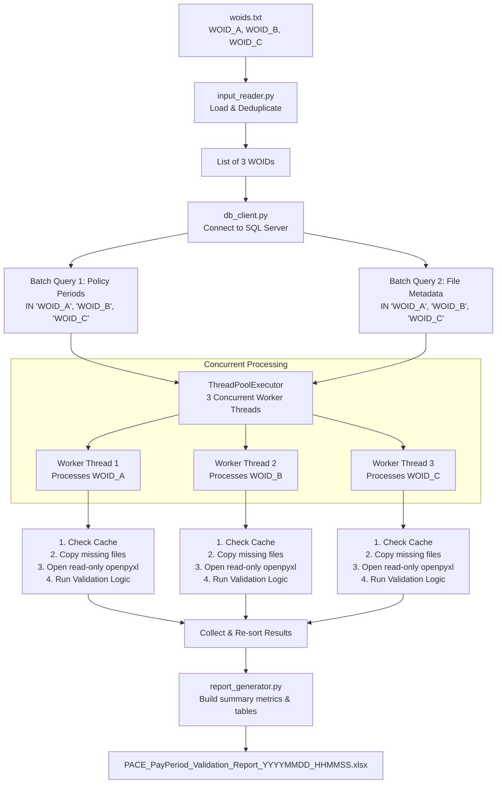

# PACE Payroll Validator — Workflow Guide

This document illustrates the execution lifecycle of the PACE Payroll Validator when processing a sample input file containing 3 Work Order IDs (`WOID_A`, `WOID_B`, and `WOID_C`).

---

## High-Level Execution Flow

Here is a visual map of how the 3 WOIDs transition through the pipeline from the input file to the final Excel report:



---

## Detailed Step-by-Step Walkthrough

### **Step 1: Input Parsing (`input_reader.py`)**
*   **Action:** The user launches the script, pointing to an input file containing:
    ```text
    WOID_A
    WOID_B
    WOID_C
    ```
*   **Process:** The input reader checks the extension, cleans any trailing whitespaces, removes duplicates, and outputs a clean list: `["WOID_A", "WOID_B", "WOID_C"]`.

---

### **Step 2: Batch Query Retrieval (`db_client.py`)**
Instead of executing sequential queries for each individual WOID (which would take 6 separate SQL connections/queries), the optimizer executes exactly **2 batched queries**:
1.  **Policy Period Query:**
    ```sql
    SELECT woid, InceptionDate, ExpirationDate
    FROM osi..WOPolicy
    WHERE woid IN ('WOID_A', 'WOID_B', 'WOID_C')
    ```
2.  **File Metadata Query:**
    ```sql
    SELECT PrimaryIndex, DocName, ReposSpec
    FROM Docrepository..Documents
    WHERE PrimaryIndex IN ('WOID_A', 'WOID_B', 'WOID_C')
      AND DocDesc = 'PACE Extracted'
    ```
These return dictionaries containing policy periods and document details grouped by WOID.

---

### **Step 3: Parallel Thread Dispatching (`main.py`)**
The application initializes a `ThreadPoolExecutor` with a thread pool size of 3 (one thread per WOID) to execute the I/O-intensive copying and parsing tasks simultaneously.

---

### **Step 4: Concurrency in Action (Per-WOID Pipeline)**
Each thread executes the function `_process_woid(woid, policy_period, files_metadata)` in parallel:

#### **Thread 1: Processes `WOID_A`**
1.  **Cache Verification (`file_retriever.py`):** Checks if folder `dataset/WOID_A` and the files listed in the database already exist locally.
    *   *Scenario:* `payroll_file1.xlsx` exists and matches the source size exactly. The copy operation is **skipped** (saving network bandwidth).
2.  **Excel Reading (`payroll_extractor.py`):** Opens `payroll_file1.xlsx` in `read_only=True` mode. Normalizes header row to locate column positions for `payperiodstart` and `payperiodend`.
    *   *Result:* Extracted pay periods: `[(2026-01-01, 2026-01-31), (2026-02-01, 2026-02-28)]`.
3.  **Algorithmic Validation (`validator.py`):**
    *   Sorts and merges the pay periods.
    *   Clips them against the policy period (`2026-01-01` to `2026-02-28`).
    *   *Result:* Gaps list is empty -> Status is marked **`FULL`**.

#### **Thread 2: Processes `WOID_B`**
1.  **Cache Verification:** Looks at `dataset/WOID_B`.
    *   *Scenario:* No local files found. It copies all attached documents from raw paths using `shutil.copy2`.
2.  **Excel Reading:** Opens sheet in read-only mode and extracts dates.
    *   *Result:* Extracted pay periods: `[(2026-01-01, 2026-01-15), (2026-02-01, 2026-02-28)]`.
3.  **Algorithmic Validation:**
    *   Clips to policy window (`2026-01-01` to `2026-02-28`).
    *   Identifies missing gap: `(2026-01-16, 2026-01-31)`.
    *   *Result:* Coverage is **`PARTIAL`** (with 1 missing gap).

#### **Thread 3: Processes `WOID_C`**
1.  **Cache Verification:** Checks metadata and skips or copies files.
2.  **Excel Reading:** Attempts to extract date columns, but files contain zero matching headers or dates.
    *   *Result:* No pay periods extracted.
3.  **Algorithmic Validation:**
    *   *Result:* Coverage is marked **`NO`**.

---

### **Step 5: Consolidation & Formatting (`report_generator.py`)**
*   **Re-sorting:** The main thread gathers the results from the threads and sorts them back into the original request sequence: `WOID_A` $\rightarrow$ `WOID_B` $\rightarrow$ `WOID_C`.
*   **Report Synthesis:** Builds a professional Microsoft Excel sheet:
    *   **Summary Section:** Total = 3 | FULL = 1 | PARTIAL = 1 | NO = 1.
    *   **Detailed Table:**
        *   `WOID_A` -> Status: **FULL** (styled green)
        *   `WOID_B` -> Status: **PARTIAL** (styled amber)
        *   `WOID_C` -> Status: **NO** (styled red)
*   **Unique File Creation:** Saves the results to a uniquely timestamped spreadsheet name (e.g., `PACE_PayPeriod_Validation_Report_20260603_190450.xlsx`).
